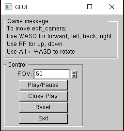
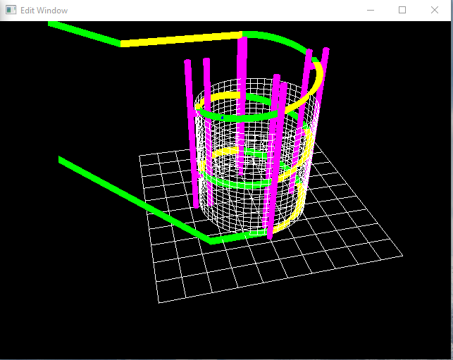
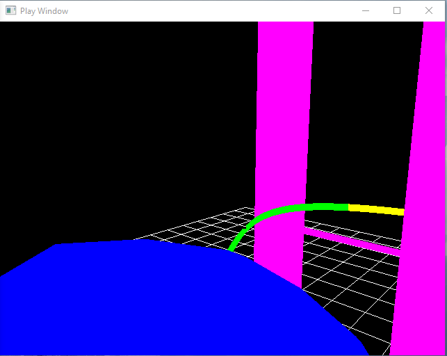

# Roller coaster

Roller coaster is a 3D simulation of  the first view when sit in a roller coaster. 
This project uses 
* C++, openGL and mainly Bezier curve to render the track.
* ODEs to simulate physics for the ball

## Quick-start

* clone or download this repository
* open Roller/Roller.sln in visual studio 2017
* Run the project
  

## Demo
* when first run, there will be a control panel, allow play/pause

* and a window to see the track top-down

* when press play, the first view will appear

## Edit code

* Roller/source.cpp: the main function, can edit roller track here
* Roller/ball.cpp: physics of ball
* Roller/gameshare.cpp: program constants
* Roller/gui.cpp: handle gui in control panel